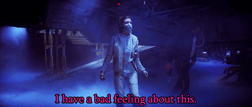
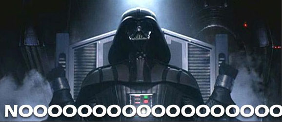

***
***

From a textmining point of view movie scripts are very interesting. They are mainly consisting of dialogues, and since cinema is a medium that tells the whole story in the span of a couple of hours, emotions tend to run high as well. I analysed the Star Wars original trilogy movie scripts exploring the word usage in the trilogy as a whole as well as in the individual movies. I investigated the sentiment change throughout each movie, along with the most frequent words with positive and negative sentiments. I additionally explored the most common word choices of six main characters of the movies as well as the frequency they express the eight basic emotions found in the NRC emotion lexicon.


### The dataset


In this project I analysed the Star Wars original trilogy movie scripts downloaded from kaggle. The original text contained the humanly comprehensible dialogs from the three movies (so sadly the lines of both Chewbacca and R2D2 were left out). The text was arranged with each line having its own row, and the index of the current line together with the speaking character's name was written at the beginning of each row.
To prepare the text for analyis, I separated the line numbers and character names into distinct columns ("num", "speaker" and "script" for the text). I combined the three movie scripts into one dataframe, and created a new variable ("movie") as well.


```{r, echo=FALSE, message=FALSE, warning=FALSE}
# Importing the three movie scripts and splitting the talking character names and the actual dialog into separate columns & creating a new variable "movie" for movies 1-3

# loading packages
library(tidyverse)
library(tidytext)
library(tidyr)
library(ggrepel)
library(gridExtra)
library(wordcloud)
library(RColorBrewer)
library(igraph)
library(ggraph)
library(fmsb)

# importing the 3 scripts (current format: 1 row/line)
SW_data_1 <- read_tsv("SW_EpisodeIV.txt")
SW_data_2 <- read_tsv("SW_EpisodeV.txt")
SW_data_3 <- read_tsv("SW_EpisodeVI.txt")

# separating the number of a line (within the movie), the speaking character and the actual dialog as separate columns + creating a new variable for the movie title
SW_data_1 <-
  SW_data_1 %>% 
  separate (col = `character" "dialogue`, into = c("num","speaker", "script"), 
            sep= '" "') %>% 
  mutate(movie = "A New Hope")
SW_data_2 <-
  SW_data_2 %>% 
  separate (col = `character" "dialogue`, into = c("num","speaker", "script"), 
            sep= '" "') %>% 
  mutate(movie = "The Empire Strikes Back")
SW_data_3 <-
  SW_data_3 %>% 
  separate (col = `character" "dialogue`, into = c("num","speaker", "script"), 
            sep= '" "') %>% 
  mutate(movie = "Return of the Jedi")

# Combining all movie scripts into 1 dataframe
SW_all <- bind_rows(SW_data_1, SW_data_2, SW_data_3)
head(SW_all, n=5)

```


***


### Exploring the three movie scripts


To create a first impression of the verbal repertoire of the movies, I started by examining the trilogy together. First I created a word cloud of the most common words (excluding the stop words) in the movies, then explored the most prevalent relationships between words by separating the scripts into word pairs (bigrams) and calculating the pairs' frequency.


<center>
<div style="width:500px">
```{r, echo=FALSE, message=FALSE, warning=FALSE}
# separate all 3 movies scripts into words and count them
all_words <-
  SW_all %>% 
  unnest_tokens(word, script, token = "words")%>%
  anti_join(stop_words, by = "word") %>%
  count(word, sort = TRUE)

# create a wordcloud
wordcloud(words = all_words$word, freq = all_words$n, min.freq = 1,
          max.words=100, random.order=FALSE, rot.per=0.35, family = "mono", font = 2,
          colors=brewer.pal(9, "BrBG"))


```
</center>


The combined word cloud of the movie trilogy shows that the most common word in the scripts is "Luke", which is not suprising since the protagonist's name is used fairly frequently in movies. Other regularly used words include "sir" and "artoo", presumably by virtue of Threepio. Most of the main characters' names are present in the wordcloud along with the franchise's characteristic words like "jedi", "ship" and "force".


<center>
<div style="width:400px">
```{r, echo=FALSE, message=FALSE, warning=FALSE}

# creating bigrams for all 3 movies 
sw_ngrams<-
  SW_all %>% 
  unnest_tokens(bigram, script, token = "ngrams", n = 2) %>% 
  separate(bigram, c("word1", "word2"), sep = " ") %>% 
  filter(!word1 %in% stop_words$word) %>%
  filter(!word2 %in% stop_words$word)

# counting the prevalence of each bigram
ngram_count<-
  sw_ngrams %>% 
  count(word1, word2, sort = TRUE) %>% 
  drop_na()

# visualizing the relationship between the most common bigrams (present more than 5 times)
ngram_count %>% 
  filter(n >= 5) %>%
  graph_from_data_frame() %>% 
  ggraph(layout = "fr") +
  geom_edge_link(aes(edge_alpha = n, edge_width = 2), show.legend = FALSE, edge_colour = "cyan4") +
  geom_node_point(size = 5) +
  geom_node_text(aes(label = name), repel = TRUE, 
                 point.padding = unit(0.2, "lines")) +
  theme_void()


```
</center>


Looking at the graph illustrating the the word pairs frequantly present together, we can see that the movies only have a few clusters of expressions that are used together. Most of the frequent pairs are either names (obi-wan kenobi), titles (princess leia) or science fiction specific expressions (light speed, star destroyer). Among these most common bigrams the only pair that is not an established expression or name is "bad feeling", which has become an iconic remark of the franchise.


<center>
<div style="width:300px">

</center>


***


### Comparing the three movies - sentiment analysis


After exploring the trilogy as a whole, we can take a look at the individual movies a bit more closely. First I checked how the sentiment changes throughout the course of each movie. After separating the scripts into words (excluding stop words), I conducted a sentiment analysis using the Bing library containing positive and negative sentiments. To examine the change of sentiment over time, i separated each movie into smaller segments (number of the movie's lines devided by 10) and counted the emotional words in a segment. The overall sentiment of a segment was calculated by subtracting the number of negative words from the number of positive words.


<center>
```{r, echo=FALSE, message=FALSE, warning=FALSE}

# sort the dataset by movie and separate the words
movies <- SW_all %>%
    group_by(movie) %>% 
    mutate(linenumber = row_number()) %>% 
    ungroup() %>% 
    unnest_tokens(word, script, token = "words") %>% 
    anti_join(stop_words, by = "word")

# arrange the movie variable to movies 1-3 instead of alphabetic
movies$movie = factor(movies$movie, levels=c('A New Hope','The Empire Strikes Back','Return of the Jedi'))

# conduct the sentiment analysis (using bing) usint the number of lines/10 as index
SW_sentiment <- movies %>%
  inner_join(get_sentiments("bing")) %>%
  count(movie, index = linenumber %/% 10, sentiment) %>%
  spread(sentiment, n, fill = 0) %>%
  mutate(sentiment = positive - negative)

# visualize it
ggplot(SW_sentiment, aes(index, sentiment)) +
    geom_line() +
    geom_point(aes(color = sentiment >= 0)) +
    geom_smooth()+
    labs(color="Emotional valence", x = "Timeline of the movie", y="Sentiment")+
    scale_color_discrete(labels=c("Negative","Positive"))+
    facet_wrap(~movie, ncol = 1, scales = "free_x")


```
</center>


Comparing the changes in sentiment within the movies we see that the third movie of the trilogy, Return of the Jedi seem to be the most turbulent, due to its larger, more slowly changing peaks in sentiment. The other two movies have more rapid changes, both presenting higher peaks of alternating negative and positive sentiments at the beginning and in the middle of the movies. Despite the number of negative sentiments growing as we arrive to the last scenes of the movies, all three stories seem to end on a happy note.


To get a better picture of the sentiments in the three movies, next I examined the frequently used emotional words in each movie. I performed a sentiment analysis with the Bing library to get the 10 most common negative and positive words within each movie.


<center>
```{r, echo=FALSE, message=FALSE, warning=FALSE, fig.height=6, fig.width=6}

# conducting a sentiment analysis for the 3 movies separately from the bing database

emot1<-movies %>%
  filter(movie=="A New Hope") %>% 
  count(word, sort = TRUE)%>% 
  inner_join(get_sentiments("bing"))%>%
  group_by(sentiment) %>%
  slice(1:10)%>%
  ungroup() %>%
  mutate(word = reorder(word, n)) %>%
      # flipped barchart devided to positive and negative sentiments
  ggplot(aes(word, n, fill = sentiment)) +
  geom_col(show.legend = FALSE) +
  facet_wrap(~sentiment, scales = "free_y") +
  labs(title="A New Hope",x = NULL, y= NULL) +
  theme(plot.title = element_text(hjust = 0.5))+
  coord_flip()

emot2<-movies %>%
  filter(movie=="The Empire Strikes Back") %>% 
  count(word, sort = TRUE)%>% 
  inner_join(get_sentiments("bing"))%>%
  group_by(sentiment) %>%
  slice(1:10)%>%
  ungroup() %>%
  mutate(word = reorder(word, n)) %>%
      # flipped barchart devided to positive and negative sentiments
  ggplot(aes(word, n, fill = sentiment)) +
  geom_col(show.legend = FALSE) +
  facet_wrap(~sentiment, scales = "free_y") +
  labs(title="The Empire Strikes Back",x = NULL, y= NULL) +
  theme(plot.title = element_text(hjust = 0.5))+
  coord_flip()

emot3<-movies %>%
  filter(movie=="Return of the Jedi") %>% 
  count(word, sort = TRUE)%>% 
  inner_join(get_sentiments("bing"))%>%
  group_by(sentiment) %>%
  slice(1:10)%>%
  ungroup() %>%
  mutate(word = reorder(word, n)) %>%
      # flipped barchart devided to positive and negative sentiments
  ggplot(aes(word, n, fill = sentiment)) +
  geom_col(show.legend = FALSE) +
  facet_wrap(~sentiment, scales = "free_y") +
  labs(title="Return of the Jedi",x = NULL, y= NULL) +
  theme(plot.title = element_text(hjust = 0.5))+
  coord_flip()

# combining the barchart of the 3 movies with gridarrange
grid.arrange(emot1, emot2, emot3, ncol=1,nrow=3)
 
```
</center>


The most common negative word in the first movie in "bad", which is replaced by "dark" in the second and third movies, presumably after we learn enough about the dark side of the Force for it to be a frequent topic. Both the second and the third movie seem to have a darker mood with the comparatively lighter negative words of the first movie ("bad", "trouble", "worry") being replaced by more grim ones ("dark", "attack", "die") on the top of the list.
One of most frequent positive words in all moves is "master", which is probably used as a noun in the movies, gives that Threepio often uses it as an honorific.


***


### Examining the characters


Since movie scripts mainly consist of dialogue, one of the most interesting things to investigate is the speaking characters' word choices and sentiment. To narrow down which characters would be most interesting, I first checked which characters have an appropriately large number of lines (I picked 100 lines as a cutpoint) to provide enough data for the analysis.


<center>
<div style="width:350px">
```{r, echo=FALSE, message=FALSE, warning=FALSE, fig.width=6, fig.height=4}

# To determine the characters with the most speaking lines, we select the ones who have more than 100 lines (in all the 3 movies together)
  SW_all %>% 
  group_by(speaker) %>% 
  summarize(N=n()) %>% 
  arrange(.,desc(N)) %>% 
  filter(N>100) %>% 
      # illustrate the number of lines on a bargraph
  ggplot(., aes(x=speaker, y=N, fill=speaker))+
  geom_bar(stat="identity")+
  geom_text(aes(label=N), vjust=1.6, color="black", size=5)+
  guides(fill=FALSE)+
  scale_fill_brewer(palette="BrBG")+
  labs(title="Characters with the highest number of speaking lines", x="Character", y = "Number of lines")+
  theme(plot.title = element_text(hjust = 0.5))


```
</center>


The characters with the most speaking lines are unsurprisingly the three protagonists (Han Solo, Luke and Leia) along with the main forces of good and evil in the trilogy (Ben Kenobi and Darth Vader). Threepio has surprisingly much lines for a side character, but it doesn't come as a shock to anyone who has seen the movies.


In the two further analyses i focused on these 6 main characters. First I explored the most frequently used words (that are not stop words) for each character, comparing them with a comparison cloud.


<center>
<div style="width:500px">
```{r, echo=FALSE, message=FALSE, warning=FALSE}

# Deviding the dialog of the main characters (over 100 lines) to words and preparing the data to be an imput for a comparison cloud

luke_words <-
  SW_all %>% 
  filter(speaker == "LUKE") %>% 
  unnest_tokens(word, script, token = "words")%>%
  anti_join(stop_words, by = "word") %>%
  count(word, sort = TRUE) %>% 
  rename(LUKE ="n")

leia_words <-
  SW_all %>%
  filter(speaker == "LEIA") %>% 
  unnest_tokens(word, script, token = "words")%>%
  anti_join(stop_words, by = "word") %>%
  count(word, sort = TRUE) %>% 
  rename(LEIA ="n")

han_words <-
  SW_all %>%
  filter(speaker == "HAN") %>% 
  unnest_tokens(word, script, token = "words")%>%
  anti_join(stop_words, by = "word") %>%
  count(word, sort = TRUE) %>% 
  rename(HAN ="n")

threepio_words <-
  SW_all %>%
  filter(speaker == "THREEPIO") %>% 
  unnest_tokens(word, script, token = "words")%>%
  anti_join(stop_words, by = "word") %>%
  count(word, sort = TRUE) %>% 
  rename(THREEPIO ="n")

vader_words <-
  SW_all %>%
  filter(speaker == "VADER") %>% 
  unnest_tokens(word, script, token = "words")%>%
  anti_join(stop_words, by = "word") %>%
  count(word, sort = TRUE) %>% 
  rename(VADER ="n")

ben_words <-
  SW_all %>%
  filter(speaker == "BEN") %>% 
  unnest_tokens(word, script, token = "words")%>%
  anti_join(stop_words, by = "word") %>%
  count(word, sort = TRUE) %>% 
  rename(BEN ="n")

# combining them for comparison cloud
w_all<-
  full_join(luke_words, leia_words) %>% 
  full_join(., han_words) %>% 
  full_join(., threepio_words) %>% 
  full_join(.,vader_words)%>% 
  full_join(.,ben_words)%>% 
  replace(., is.na(.), 0) %>% 
  column_to_rownames("word")


# creating a comparison cloud
comparison.cloud(w_all, random.order=FALSE,
title.size=1.8, max.words=500)

```
</center>


Comparing the speech of the 6 main characters, we can see that the out of the 6, Threepio uses the most repetition with "artoo" and "sir" being both his most common words, and the most common words overall. All characters use names of fellow characters frequently: Han's most commonly used word is "chewie", Leia uses "kenobi" and "han" fairly often, Luke's most common word is "ben" and Ben's "luke", and Vader talks about "obi wan" frequently. 
Some of the characters' word clouds seem to lean toward a theme characteristic to them. Both Leia and Vader use words related to stategy and tactics ("ship", "information", "rebel"). Ben's words are mostly related to the Force and the jedi order ("jedi", "force"). Both Han and Threepio use a lot of emotional words ("worry", "afraid", "huh", "oooh").


***


In addition to the characters most commonly used words, it can be interesting to check what types of emotions they express most frequently. The NRC Emotion lexicon contains basic emotions (anger, trust, surprise, sadness, joy, fear, disgust, anticipation) and two sentiments (positive and negative). To compare the main characters emotional demeanor, I conducted a sentiment analysis for each character using the NRC lexicon, focusing on the eight emotions and leaving out the sentiments. Since there is a significant difference in the number of speaking lines between the characters, i calculated the ratio of the word count of each emotion and the total (not stop word) word count for each character for a better comparison.


<center>
```{r, echo=FALSE, message=FALSE, warning=FALSE, fig.width=10}

emotions<-
  SW_all %>% 
  filter(speaker==c("LUKE", "LEIA", "HAN", "VADER", "BEN", "THREEPIO")) %>% 
    # separate the text into words
  unnest_tokens(word, script, token = "words")%>%
  anti_join(stop_words, by = "word") %>%
    # create a variable for all not-stopwords for each character (to determine the ratio of            emotional words later) 
  group_by(speaker) %>% 
  mutate(all_words=n()) %>% 
  ungroup() %>% 
    # do sentiment analysis for specific emotions
  inner_join(get_sentiments("nrc"),  by = "word") %>%
  filter(!sentiment %in% c("positive","negative")) %>%
    # create emotional word/all words analysis for each characters each emotion
  group_by(speaker, sentiment) %>% 
  summarise(N=n(), all=mean(all_words)) %>% 
  mutate(emo_ratio=N/all) %>% 
    # prepare the dataset for a radar chart
  select(speaker, sentiment, emo_ratio) %>% 
  spread(sentiment, emo_ratio) %>% 
  ungroup() %>% 
  add_row(speaker= c("Max", "Min"),anger=c(0.15, 0), anticipation=c(0.15, 0), disgust=c(0.15, 0), fear=c(0.15, 0), joy=c(0.15, 0), sadness=c(0.15, 0), surprise=c(0.15, 0), trust=c(0.15, 0), .before=1) %>% 
  column_to_rownames("speaker") %>% 
  ungroup()

# defining the colors (with opacities) for the radar chart
colors_border<-c(rgb(0.7,0.5,0.1,0.9),rgb(0.5,0.2,0.5,0.9), rgb(0.5,0.2,0.1,0.9), rgb(0.2,0.5,0.5,0.9),rgb(0.8,0.2,0.5,0.9) ,rgb(0.2,0.8,0.1,0.9))
colors_in<-c(rgb(0.7,0.5,0.1,0.1),rgb(0.5,0.2,0.5,0.1),rgb(0.5,0.2,0.1,0.1),rgb(0.2,0.5,0.5,0.1),rgb(0.8,0.2,0.5,0.1) ,rgb(0.2,0.8,0.1,0.1))

# creating the radar chart 
radarchart(emotions, axistype=0, pcol=colors_border, plty=1, plwd=3, pfcol=colors_in, cglcol="grey", cglty=1)
legend(x=1.5, y=1, legend = c("Ben", "Han", "Leia", "Luke", "3PO", "Vader"), bty = "n", pch=20 , col=colors_border , text.col = "gray33", cex=1.2, pt.cex=3)


```
</center>


The first glance at the radar chart tells us that the expression of the 8 examined emotions is pretty diverse between characters. We can make the general observation that disgust seems to be the most underrepresented emotion, while almost all of the characters express trust fairly regularly.

Han Solo seems to be the most emotive out of the main characters, he has the highest number of emotional words in almost all categories, particularly for positive emotions (anticipation, joy), but also for surprise. 
One of the surprising results is that fear doesn't seem to be Threepio's defining characteristic, instead Ben is the character who most regularly expresses fear.
Despite the Dark Side supposedly stemming from one's anger and fear, Darth Vader does not seem to express these emotions very often. He seems to be one of the least emotionally expressive characters, except for sadness (but this result might be simply an indicator of his disappointment in his underlings and their lack of faith).


<center>
<div style="width:300px">

</center>


***


### Summary 


The text mining analysis of the Star Wars original trilogy movie scripts showed that for the trilogy as a whole, the most common words and word pairs are either names or science fiction / Star Wars specific expressions. Comparing the sentiments of the individual movies we saw that the third movie seems to be more turbulent than the other two, and the negative words used in the second and third movie were slightly more dark, than in the first movie. The analysis of the characters' word choices showed that their most common words were almost always names as well as some characteristic words. The sentiment analysis focusing on 8 basic emotions showed that Han Solo seems to be the most emotive of the characters, and Darth Vader is one of the least emotionally expressive ones.

However, most of these methods are based on separating the words from their original context and determining their valence and emotional connotations on their own. Individual words often gain different meaning out of their context (eg. leaving out a "don't" preceding a "worry"), so it is better to interpret these results with caution.


***
***


